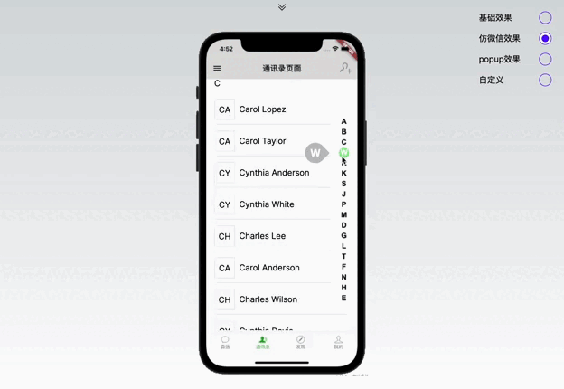

# @meplay/react

A lib of a collection of some components created by me.

## Installation

```javascript
npm install @meplay/react

// or

yarn add @meplay/react

// or

pnpm add @meplay/react
```

## Table of content

- [CanvasIndex](#canvas-index)

## <h2 id="canvas-index">CanvasIndex</h2>

An index component inspired by wechat contact.

### Live Demos

> see [live](https://meplay.vercel.app/contact)



### Props

| prop               | default                                                             | required | description                                                                                                                 |
| ------------------ | ------------------------------------------------------------------- | -------- | --------------------------------------------------------------------------------------------------------------------------- |
| list               | -                                                                   | true     | The letters to render                                                                                                       |
| indexOptions       | `{width: 50,height: 300,font: 'bold 14px Arial',fillStyle: '#000'}` | false    | Options determine the width and height of the index canvas component, as well as the color and font of the letters rendered |
| effect             | popup                                                               | false    | base / wechat / popup / custom                                                                                              |
| durations          | 2000                                                                | false    | Time to wait until the effect fades away(not working for custom effect)                                                     |
| activeColor        | lightgreen                                                          | false    | The active color on Index when click (not working for custom effect)                                                        |
| className          | -                                                                   | false    | Classname for the canvasWrapper                                                                                             |
| emphasizeClassName | -                                                                   | false    | Classname for the emphasize div (only works for popup mode)                                                                 |
| onClickLetter      | -                                                                   | false    | Callback to get the clicked letter for custom mode only                                                                     |
| onDrawIndex        | -                                                                   | false    | Callback to emit the drawIndex class instance so that you can customize things                                              |

## Usage

```javascript
import { CanvasIndex, IndexEffect } from '@meplay/react';
import '@meplay/react/style.css';

const indexList = ['A', 'B', 'C'];

export const WebContactIndex: React.FC = () => {
  return <CanvasIndex effect={'wechat'} list={indexList} />;
};
```
